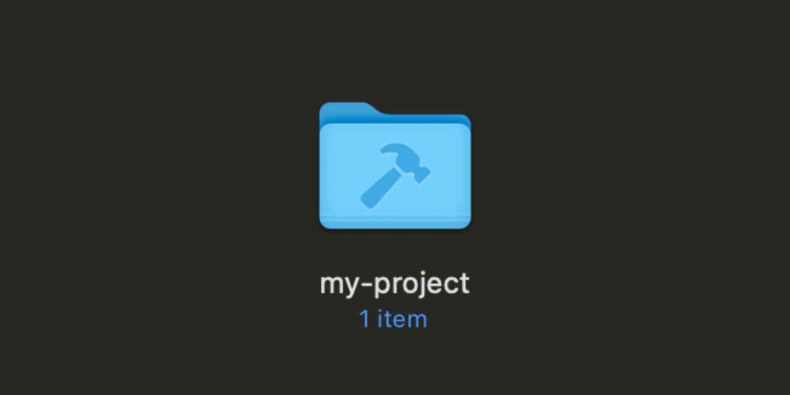

# mkdevdir

mkdevdir is a simple command-line utility for macOS that allows you to effortlessly set custom developer icons for your directories and create new directories with a distinctive look. This tool is an essential asset for developers who want to visually organize and enhance their project directories using MacOS original developer icon.

If you create a "Developer" directory directly in your macOS user directory (e.g., /Users/yourusername/Developer), MacOS automatically assigns the developer icon to this directory. However, mkdevdir allows you to apply this icon to any directory in your system, giving you more flexibility in organizing your development projects.

<p align="center">

</p>

## Features

- Set Apple's original developer icon for existing directories or create new directories with this custom icon
- Use as a replacement for `mkdir` specifically for developer directories, creating visually distinct directories with the developer icon in one command
- Seamless functionality with both local and system-wide installations
- Easy installation and uninstallation process

## Requirements

- macOS (This tool uses macOS-specific commands like `SetFile`)

## Installation

1. Clone this repository or download the source files.
2. Open a terminal and navigate to the project directory.
3. Run the installation script:

```bash
sudo ./install.sh
```

The installation script will:
- Copy the main script to `/usr/local/bin`
- Create a directory for the icon asset at `/usr/local/share/mkdevdir_assets`
- Copy the icon file to the assets directory
- Make the script executable

## Usage

After installation, you can use the command from any directory:

```bash
mkdevdir <target_directory_path>
```

For example:

```bash
mkdevdir ~/Projects/MyAwesomeProject
```

This will set the custom icon for the specified directory. If the directory doesn't exist, it will be created.

## How It Works

The main script (`mkdevdir.sh`) performs the following actions:

1. Checks if the target directory exists, creating it if necessary.
2. Locates the custom icon file (either from the local assets or the system-wide installation).
3. Copies the custom icon file to the target directory.
4. Sets the necessary attributes to make the icon visible and the icon file invisible.

## Uninstallation

To uninstall the tool, use the uninstallation script:

```bash
sudo ./uninstall.sh
```

The uninstallation script will:
- Remove the main script from `/usr/local/bin`
- Remove the icon assets directory from `/usr/local/share/mkdevdir_assets`

## File Structure

- `mkdevdir.sh`: The main script that sets the custom icon
- `assets/Icon`: The custom icon file (note: the file name includes a carriage return)
- `install.sh`: Handles the installation process
- `uninstall.sh`: Handles the uninstallation process

## Troubleshooting

- If the command is not found after installation, you may need to add `/usr/local/bin` to your PATH or restart your terminal.
- Make sure you have the necessary permissions to modify the target directories.
- If the icon doesn't appear immediately, try refreshing the Finder view or restarting Finder.

## Contributing

Contributions are welcome! Please feel free to submit a Pull Request.

## Acknowledgements

- This tool uses macOS-specific commands and is designed for use on macOS systems.
- The custom icon file is stored with a carriage return in its name, which is a specific requirement for custom folder icons in macOS.
